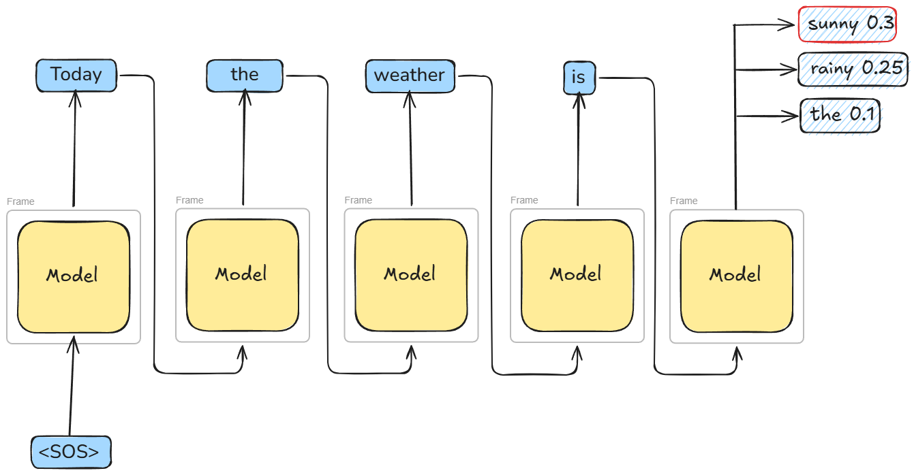
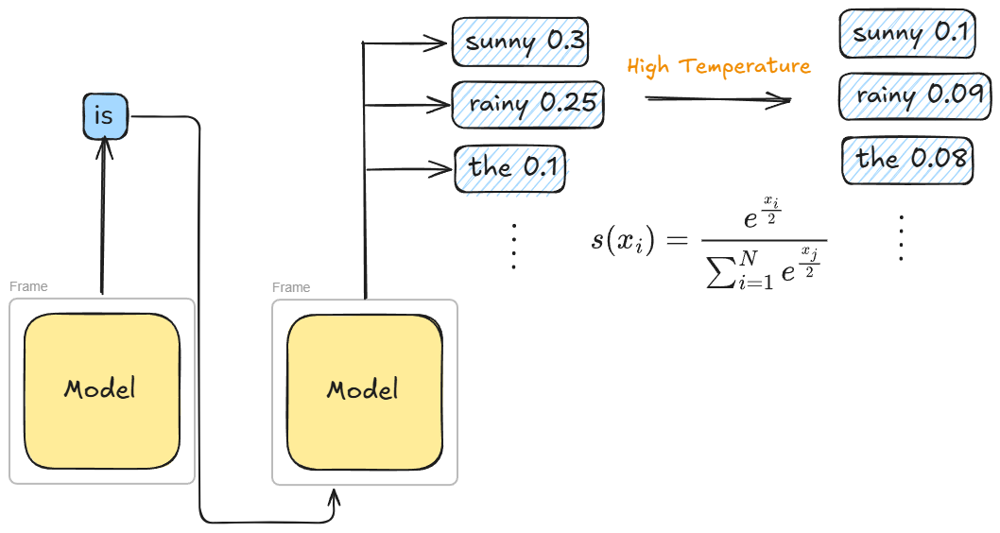
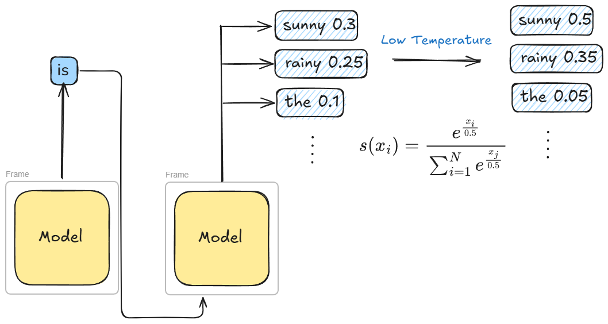
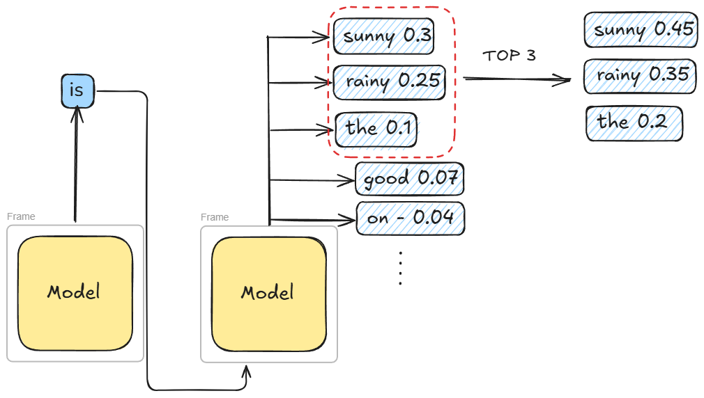
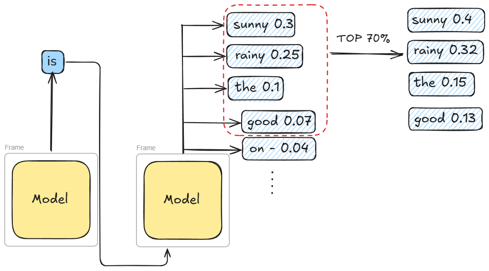

## Distribution over vocabulary

{width="100%" fig-align="center"}

## Temperature

Controls the randomness in the sampling process.

### Softmax function:

$$s(x_i) = \frac{e^{x_i}}{\sum_{i=1}^{N} e^{x_j}}$$

Approximately $argmax(x_i)$, but has smooth gradients

## Temperature

Controls the randomness in the sampling process.

### Softmax function:

::: {style="font-size: 1.1em;"}
$$s(x_i) = \frac{e^{\frac{x_i}{\color{red}{\theta}}}}{\sum_{i=1}^{N} e^{\frac{x_j}{\color{red}{\theta}}}}$$

$\color{red}{\theta}$ - Temperature parameter
:::

## High Temperature

{width="100%" fig-align="center"}

## Low Temperature

{width="100%" fig-align="center"}

## Top-k
{width="100%" fig-align="center"}

## Top-p
{width="100%" fig-align="center"}
